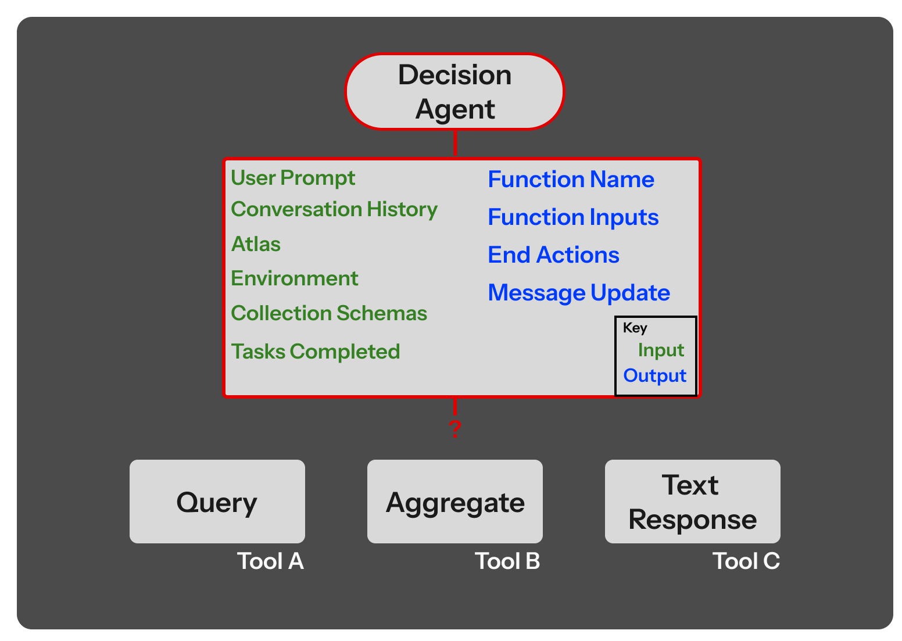

# Technical Overview

Let's break down the Elysia decision tree, how exactly it runs and how objects persist over multiple iterations. 

We will consider a 'standard' Elysia set up as an example, where we have access to two tools: 'Query' and 'Aggregate', which both interact with custom data. There are two additional tools: 'Summarize' and 'Text Response', which both provide text outputs (with slightly different specifications).

{ align="center" width="75%" }

## Decision Agent

The decision agent (which is run from the `base_model`) is responsible for choosing the tools to call/nodes for each decision step. The decision tree structure consists of 'branches', which are subcategories for tools, used to separate out different tools if there are many of them, and tools, which are actions to perform. Tools should add information to the Elysia _environment_. The environment is used within the decision agent as well as any tools so the process is aware of any retrieved or collected data.

The inputs to the decision tree are:

- The tree data ([see below](#tree-data)).
- Tool descriptions.
- Instruction for the branch (e.g. how to make the choice between the currently available tools).
- Metadata on the tree, including how many loops through the tree has been made, as well as future tools that exist within a branch.

The decision agent assigns the following outputs:

- Tool to use.
- Inputs to the tool if they exist.
- Whether to end the tree after calling this tool (although this is conditional on the tool also allowing the process to end after its call).
- A message update to the user.
- Whether the task is impossible given all other information.

## Tree Data

The tree data is a subset of the most important data in the Elysia decision tree. This includes the most pertinent information, such as the user prompt and the conversation history, as well as the _Atlas_, an alias to the style, agent description and end goal that the agent must adhere to, and the _environment_, a collection of all data retrieved or collected by Elysia during tool evaluations. A history of completed tasks and custom formatted text from the tools is also included. Any errors (that were manually caught and yielded) during tool evaluations are also included into the tree data, so that the decision agent or subsequent runs of the tools can be aware of previous failures.

The tree data is included in the decision agent and can be also included in any LLM calls within tools. The tree data is essentially the way that tools 'interact' with Elysia, by including information of the state of the tree and updating this state information.

To see a full breakdown of the tree data, [see the description for the `TreeData` class](../Reference/Objects.md#elysia.tree.objects.TreeData). 
