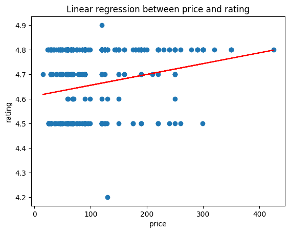

Let's create a tool which performs a least squares regression on numeric data retrieved from a Weaviate collection. For this example, we will use the default branch initialisation for the decision tree (`"one_branch"`), which includes tools for querying and retrieving data from a Weaviate collection. We are going to add a `BasicLinearRegression` tool that extracts data from the environment and solves the least squares problem to obtain coefficients for the regression.

## Initial Setup

Let's [follow the basic guideline for creating a tool](../Advanced/advanced_tool_construction.md), and create the skeleton of the tool below.

```python
from elysia import Error, Tool, Result
import numpy as np
import matplotlib.pyplot as plt

class BasicLinearRegression(Tool):

    def __init__(self, logger, **kwargs):
        pass

    async def __call__(
        self,
        tree_data,
        inputs,
        base_lm,
        complex_lm,
        client_manager,
        **kwargs,
    ):
        pass

    async def is_tool_available(self, tree_data, base_lm, complex_lm, client_manager):
        pass
```

The general outline for this tool is going to be as follows:

- No LLM calls within the tool, the decision agent is going to be deciding inputs for the regression.
- The call of the tool is going to transform the environment into matrices to be used for the analysis.
- The tool is going to add to the environment the labelled coefficients from the regression.
- The `is_tool_available` function is going to return `True` when there is data retrieved from the `query` tool in the environment.

### Tool Initialisation

Let's set the initialisation parameters to provide a comprehensive tool description and input descriptions.

```python
    def __init__(self, logger, **kwargs):
        super().__init__(
            name="basic_linear_regression_tool",
            description="""
            Use this tool to perform linear regression on objects in the environment with numeric data types.
            """,
            status="Running linear regression...",
            inputs={
                "environment_key": {
                    "description": (
   "A single key (string) of the `environment` dictionary that will be used in the analysis. "
                        "Choose the most relevant key for the analysis according to the user prompt. "
                        "All objects under that key will be used to create the dataframe. "
                    ),
                    "required": True,
                    "type": str,
                    "default": None,
                },
                "x_variable_fields": {
                    "description": (
                        "The independent variables for the regression. "
                        "Choose one or more fields within the `objects` underneath the specific `environment_key`. "
                    ),
                    "required": True,
                    "type": list[str],
                    "default": None,
                },
                "y_variable_field": {
                    "description": (
                        "The dependent variable for the regression. "
                        "Choose one single field within the `objects` underneath the specific `environment_key`. "
                    ),
                    "required": True,
                    "type": str,
                    "default": None,
                },
            },
            end=False,
        )
```

### Tool Call

The tool call is the `__call__` method - this will be called when the tool is selected by the LLM. So this is where the actual tool execution takes place. We need to do several things here:

1. Convert the environment (within the `tree_data`) to matrices
2. Perform least squares regression on these matrices
3. Yield relevant objects to the decision tree, so the information goes back to the tree

Let's first start with setting the tool up and collecting the inputs:
```python
    async def __call__(
        self,
        tree_data,
        inputs,
        base_lm,
        complex_lm,
        client_manager,
        **kwargs,
    ):
        environment = tree_data.environment.environment
        environment_key = inputs["environment_key"]
        x_variable_field = inputs["x_variable_field"]
        y_variable_field = inputs["y_variable_field"]
```

Now we have separated the relevant inputs and items we need, let's now proceed with **converting the environment (within the `tree_data`) to matrices**:

```python
        # initialise empty matrices to store all objects
        X = np.empty((0, 2))
        y = np.empty((0, 1))

        # iterate over all items in the environment
        for inner_key in environment[environment_key]:

            # convert all objects under this key to a matrix
            inner_X = np.array(
                [
                    [obj[x_variable_field]]
                    for environment_list in environment[environment_key][inner_key]
                    for obj in environment_list["objects"]
                ]
            )
            inner_X = np.hstack([np.ones((inner_X.shape[0], 1)), inner_X])
            X = np.vstack([X, inner_X])

            # convert all objects under this key to a matrix
            inner_y = np.array(
                [
                    [obj[y_variable_field]]
                    for environment_list in environment[environment_key][inner_key]
                    for obj in environment_list["objects"]
                ]
            )
            y = np.vstack([y, inner_y])
```
This may look a bit complicated, but its quite straightforward. Since the `environment` is keyed via two variables: the tool used which added items to the environment and then a sub-key of names within that tool, we require looping over the `inner_key` within the outer `environment_key` which was decided by the LLM.

We use NumPy to create the matrices, which are initialised to the correct dimension (the independent variable should have matrix $X$ which is $n \times 2$, since there is only one independent variable and a intercept column, and the dependent variable, $y$, should be $n \times 1$). 

Now we need to **perform least squares regression on these matrices** to obtain the regression coefficients.

```python
        # calculate the beta hat values via least squares
        beta_hat = np.linalg.inv(X.T @ X + 1e-10 * np.eye(X.shape[1])) @ X.T @ y
        beta_hat_dict = {
            "intercept": beta_hat[0],
            "slope": beta_hat[1],
        }
```

We follow the least squares solution using linear algebra to get these coefficients:
$$
    \hat{\beta} = (X^\top X + \lambda I_n)^{-1} X^\top y
$$
where $\lambda$ is small (e.g. `1e-10`). The first value in $\hat{\beta}$ will correspond to the intercept and the second value will correspond to the independent variable and its correlation with the dependent variable (the slope). We can plot these values with `matplotlib`, just for explanatory purposes:

```python
        # plot the data
        pred_y = X @ beta_hat   
        fig, ax = plt.subplots()
        ax.scatter(X[:, 1], y)
        ax.plot(X[:, 1], pred_y, color="red")
        ax.set_title(
            f"Linear regression between {x_variable_field} and {y_variable_field}"
        )
        ax.set_xlabel(x_variable_field)
        ax.set_ylabel(y_variable_field)
        fig.show()
```

This will plot the independent variable against the dependent one, include the line of best fit, and then show the plot whenever the tool is successfully run.

Now we need to **give information back to the decision tree** about the results of this analysis, so it can be used to continue the conversation and make further decisions. All tools should `yield` objects, and we use the `Result` class which automatically will assign objects to the tree's environment.

```python
        yield Result(
            objects=[
                beta_hat_dict,
            ],
            metadata={
                "x_variable_field": x_variable_field,
                "y_variable_field": y_variable_field,
            },
            llm_message=(
                "Completed linear regression analysis where: "
                "    x variable: {x_variable_field} "
                "    y variable: {y_variable_field} "
            ),
        )
```

There is only one object needed to be returned, the coefficient values. The decision agent will use this information to continue the decision tree by reading the objects. We also include what variable corresponds to where by including the `x_variable_field` and `y_variable_field` in the metadata, and include an `llm_message` to custom display that the regression was completed. 

```python
    async def __call__(
        self,
        tree_data,
        inputs,
        base_lm,
        complex_lm,
        client_manager,
        **kwargs,
    ):
        environment = tree_data.environment.environment
        environment_key = inputs["environment_key"]
        x_variable_field = inputs["x_variable_field"]
        y_variable_field = inputs["y_variable_field"]

        # initialise empty matrices to store all objects
        X = np.empty((0, 2))
        y = np.empty((0, 1))

        # iterate over all items in the environment
        for inner_key in environment[environment_key]:

            # convert all objects under this key to a matrix
            inner_X = np.array(
                [
                    [obj[x_variable_field]]
                    for environment_list in environment[environment_key][inner_key]
                    for obj in environment_list["objects"]
                ]
            )
            inner_X = np.hstack([np.ones((inner_X.shape[0], 1)), inner_X])
            X = np.vstack([X, inner_X])

            # convert all objects under this key to a matrix
            inner_y = np.array(
                [
                    [obj[y_variable_field]]
                    for environment_list in environment[environment_key][inner_key]
                    for obj in environment_list["objects"]
                ]
            )
            y = np.vstack([y, inner_y])

        # calculate the beta hat values via least squares
        beta_hat = np.linalg.inv(X.T @ X + 1e-10 * np.eye(X.shape[1])) @ X.T @ y
        beta_hat_dict = {
            "intercept": beta_hat[0],
            "slope": beta_hat[1],
        }
        pred_y = X @ beta_hat

        # plot the data
        fig, ax = plt.subplots()
        ax.scatter(X[:, 1], y)
        ax.plot(X[:, 1], pred_y, color="red")
        ax.set_title(
            f"Linear regression between {x_variable_field} and {y_variable_field}"
        )
        ax.set_xlabel(x_variable_field)
        ax.set_ylabel(y_variable_field)
        fig.show()

        # yield the result to the decision tree
        yield Result(
            objects=[
                beta_hat_dict,
            ],
            metadata={
                "x_variable_field": x_variable_field,
                "y_variable_field": y_variable_field,
            },
            llm_message=(
                "Completed linear regression analysis where: "
                "    x variable: {x_variable_field} "
                "    y variable: {y_variable_field} "
            ),
        )
```

### Controlling when the tool is available

We can also set the `is_tool_available` method to only return `True` when something relevant is in the environment. In this case, when information has been returned from the `query` tool.

```python
    async def is_tool_available(self, tree_data, base_lm, complex_lm, client_manager):
        """
        Available when the 'query' task has been completed and it has added data to the environment.
        """
        return (
            "query" in tree_data.environment.environment
            and len(tree_data.environment.environment["query"]) > 0
        )
```

We have also provided a brief description of when the tool will become available, which will be passed to the decision agent any time the tool is unavailable, so that it knows what tasks it needs to accomplish before being able to run this tool. In this case, this should inform the LM that to perform linear regression, it needs to get the data first.

## Putting it all together

Here is the full tool construction, and let's also wrap the call in a `try`/`except` block to catch any errors (using the [`Error`](../Reference/Objects.md#elysia.objects.Error) class for self-healing errors).


```python
class BasicLinearRegression(Tool):

    def __init__(self, logger, **kwargs):
        super().__init__(
            name="basic_linear_regression_tool",
            description="""
            Use this tool to perform linear regression between two numeric variables in the environment.
            """,
            status="Running linear regression...",
            inputs={
                "environment_key": {
                    "description": (
                        "A single key (string) of the `environment` dictionary that will be used in the analysis. "
                        "Choose the most relevant key for the analysis according to the user prompt. "
                        "All objects under that key will be used to create the dataframe. "
                    ),
                    "required": True,
                    "type": str,
                    "default": None,
                },
                "x_variable_field": {
                    "description": (
                        "The independent variable for the regression. "
                        "Choose one field title within the `objects` underneath the specific `environment_key`. "
                    ),
                    "required": True,
                    "type": str,
                    "default": None,
                },
                "y_variable_field": {
                    "description": (
                        "The dependent variable for the regression. "
                        "Choose one single field within the `objects` underneath the specific `environment_key`. "
                    ),
                    "required": True,
                    "type": str,
                    "default": None,
                },
            },
            end=False,
        )

    async def __call__(
        self,
        tree_data,
        inputs,
        base_lm,
        complex_lm,
        client_manager,
        **kwargs,
    ):
        environment = tree_data.environment.environment
        environment_key = inputs["environment_key"]
        x_variable_field = inputs["x_variable_field"]
        y_variable_field = inputs["y_variable_field"]

        try:

            # initialise empty matrices to store all objects
            X = np.empty((0, 2))
            y = np.empty((0, 1))

            # iterate over all items in the environment
            for inner_key in environment[environment_key]:

                # convert all objects under this key to a matrix
                inner_X = np.array(
                    [
                        [obj[x_variable_field]]
                        for environment_list in environment[environment_key][inner_key]
                        for obj in environment_list["objects"]
                    ]
                )
                inner_X = np.hstack([np.ones((inner_X.shape[0], 1)), inner_X])
                X = np.vstack([X, inner_X])

                # convert all objects under this key to a matrix
                inner_y = np.array(
                    [
                        [obj[y_variable_field]]
                        for environment_list in environment[environment_key][inner_key]
                        for obj in environment_list["objects"]
                    ]
                )
                y = np.vstack([y, inner_y])

            # calculate the beta hat values via least squares
            beta_hat = np.linalg.inv(X.T @ X + 1e-10 * np.eye(X.shape[1])) @ X.T @ y
            beta_hat_dict = {
                "intercept": beta_hat[0],
                "slope": beta_hat[1],
            }
            pred_y = X @ beta_hat

            # plot the data
            fig, ax = plt.subplots()
            ax.scatter(X[:, 1], y)
            ax.plot(X[:, 1], pred_y, color="red")
            ax.set_title(
                f"Linear regression between {x_variable_field} and {y_variable_field}"
            )
            ax.set_xlabel(x_variable_field)
            ax.set_ylabel(y_variable_field)
            fig.show()

            # yield the result to the decision tree
            yield Result(
                objects=[
                    beta_hat_dict,
                ],
                metadata={
                    "x_variable_field": x_variable_field,
                    "y_variable_field": y_variable_field,
                },
                llm_message=(
                    "Completed linear regression analysis where: "
                    "    x variable: {x_variable_field} "
                    "    y variable: {y_variable_field} "
                ),
            )
        except Exception as e:
            yield Error(str(e))

    async def is_tool_available(self, tree_data, base_lm, complex_lm, client_manager):
        """
        Available when the 'query' task has been completed and it has added data to the environment.
        """
        return (
            "query" in tree_data.environment.environment
            and len(tree_data.environment.environment["query"]) > 0
        )
```

## Experimenting

Let's initialise a tree, add the tool and test it runs correctly. In this example, a Weaviate collection called `Ecommerce` will be used. The `Ecommerce` collection has many redundant fields (for this example), but we want to evaluate whether the `price` variable correlates with the review `rating`.

```python
from elysia import Tree
tree = Tree()
tree.add_tool(BasicLinearRegression)
response, objects = tree(
    "Perform linear regression on the relationship between the price of a product and the review rating it has",
    collection_names = ["Ecommerce"]
)
```
And some relevant output from the run:
```
INFO     Tasks completed (iteration 1):
            - query (Avg. 3.90 seconds)
            - summarise_items (Avg. 0.00 seconds)
INFO     Tasks completed (iteration 2):
            - basic_linear_regression_tool (Avg. 0.01 seconds)
INFO     Tasks completed (iteration 3):
            - cited_summarize (Avg. 4.59 seconds)
```

```python
print(response)
```
`To begin, I'm querying the "Ecommerce" collection to retrieve the product price and review rating data needed for the linear regression. I am now retrieving all product prices and review ratings from the "Ecommerce" collection to prepare for the linear regression analysis. I am now performing a linear regression analysis on the retrieved data, using product price as the independent variable and review rating as the dependent variable. I have completed the linear regression analysis, revealing an intercept of approximately 4.61 and a slope of approximately 0.00044, indicating a very slight positive relationship between product price and review rating. The linear regression analysis performed on product price and review rating reveals a very slight positive relationship between the two variables. The intercept of the regression model is approximately 4.61, and the slope is approximately 0.00044. This indicates that as the product price increases, the review rating tends to increase, but only by a very small margin.`

{ align="center" width="75%" }
